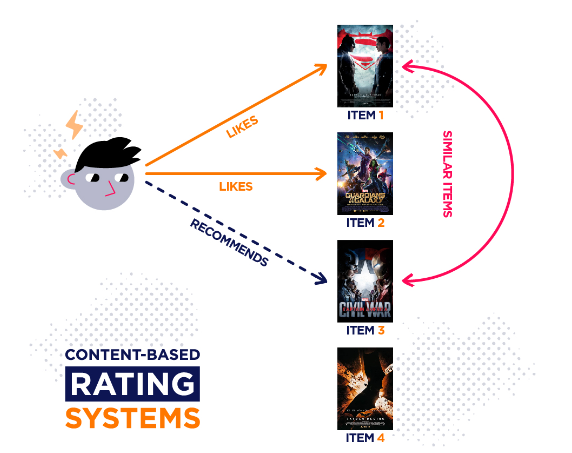

# __Building a Movie Recommender with the MovieLens Dataset__



### 1.1 Business Overview

In the age of streaming services and an abundance of movie alternatives, customers frequently face the issue of finding films that match their preferences. This project aims to build a movie recommendation system that enhances the user’s movie-watching experience by suggesting films tailored to their preferences. The system will utilize machine learning algorithms and user data to deliver tailored movie suggestions based on ratings, viewing history, and preferences, resulting in growth and competitive advantage in the entertainment industry.
The target audience for this project is companies that provide movie streaming services, such as Netflix, Amazon Prime Video, or Hulu. These companies can, in turn, use recommendation systems to increase their customer engagement and retention.


### 1.2 Problem statement
In the vast and ever-expanding landscape of film and television content, users often face the challenge of discovering movies that align with their personal tastes and preferences. With countless options available across multiple platforms, finding enjoyable and relevant movies can be overwhelming and time-consuming. Traditional methods of browsing and searching are often inefficient, leading to decision fatigue and a suboptimal viewing experience. We aim to develop a Movie Recommender System that addresses this problem by providing users with personalized, relevant, and timely movie recommendations.

### 1.3 General Objective
To develop and implement a Movie Recommender System that delivers personalized and relevant movie suggestions to users, thereby improving their movie discovery experience and increasing their satisfaction with their entertainment choices.

### 1.4 Specific Objectives

1. Analyze and determine movie ratings by calculating the Bayesian average to ensure that ratings are representative and not overly influenced by the number of raters, taking into account both the average rating and the number of votes.

2. Investigate relationships between user preferences and movie features through matrix factorization techniques, such as Singular Value Decomposition (SVD). This will help in understanding how latent factors can capture the underlying patterns in user-movie interactions, ultimately leading to more personalized recommendations.

3. Create a hybrid recommendation model that integrates collaborative filtering (with a target accuracy of 80% or higher) with content-based filtering, specifically using deep learning techniques. 

4. Deploy the developed recommendation system using Streamlit, creating an interactive interface that allows users to receive personalized movie recommendations in real-time.


### 1.5 Challenges
1. Cold start problem: Accurate recommendations will be complex to provide when there is limited data for new users or at the system's initial launch.
2. Scalability: Managing and processing large volumes of user data and movie metadata will be challenging as the system grows.
3. Algorithm Complexity: Balancing the complexity of recommendation algorithms with the need for real-time performance will be a challenge. More sophisticated algorithms might improve recommendation quality but could increase computational demands and processing time.
4. Diverse User Preferences: There will be issues when effectively handling a wide range of user tastes and preferences because failure to accommodate diverse preferences can result in recommendations that do not resonate with a large segment of users.
5. Handling Challenging Trends: Adapting to changes in user preferences and trends, such as seasonal interests or emerging genres, whereby recommendations may become outdated or irrelevant if the system cannot adapt quickly to changing user tastes.

Data preparation

The dataset ml-latest-small is from (https://grouplens.org/datasets/movielens/latest/)
It describes 5-star ratings and free-text tagging activity from movieLens, a movie recommendation system. The data contained 100836 ratings across 9742 movies and was generated on September 26th, 2018. Users were selected randomly for inclusion and all the users had rated at least 20 movies.

### Data Cleaning
Our data cleaning strategy aims to refine the dataset for subsequent analysis and modeling:

1.  **Merge `ratings` and `movies`:** We'll merge the `ratings` and `movies` DataFrames on the `movieId` column. This consolidation is essential for associating user ratings with specific movie titles and genres, enabling us to examine user preferences in relation to movie attributes and facilitating various recommendation strategies.

2.  **Timestamp Removal:** The `timestamp` column, while potentially useful for temporal analysis, is not immediately relevant.  Therefore, we'll drop this column to reduce the dataset's dimensionality and computational burden.

3.  **Duplicate Elimination:** We'll rigorously identify and remove duplicate entries within the merged DataFrame, ensuring each user-movie rating pair is unique. This step is crucial to prevent biases in subsequent analyses and models arising from duplicate ratings.

4.  **Genre Transformation:** The `genres` column in the `movies` DataFrame contains multiple genres per movie separated by '|'. We'll split this column into a list of individual genres to enable genre-based analysis and filtering, as well as potential integration into content-based filtering strategies if desired later.

5. **Title-Year Separation:** We will also extract the release year from the movie title and store it as a separate column for further analysis.
 
6. **Bayesian Average Calculation:** We'll compute the Bayesian Average for each movie's rating.  This approach mitigates the inherent bias of simple average ratings, especially for movies with few ratings, by incorporating the global average rating and the average number of votes per movie. The Bayesian Average formula is:

```
Bayesian Average = ( (C * m) + (R * v) ) / (C + v)
```

where:

*   R = average rating for the movie
*   v = number of votes for the movie
*   m = average rating across all movies
*   C = average number of votes per movie across all movies

By comparing the Bayesian Average with simple average ratings, we'll assess the impact of this adjustment on the perceived popularity of movies, particularly those with limited ratings. We'll visually represent this comparison to discern how the Bayesian Average smooths out the rating distribution.

###EDA

## Univariate Analysis
### Top and Bottom Rated Movies & Users:

Top Rated Movies:
| title                              | avg_rating   |
|:-----------------------------------|:-------------|
| Shawshank Redemption, The          | 4.30266      |
| Fight Club                         | 4.12902      |
| Godfather, The                     | 4.12635      |
| Star Wars: Episode IV - A New Hope | 4.10989      |
| Pulp Fiction                       | 4.09966      |

Bottom Rated Movies:
| title                           | avg_rating   |
|:--------------------------------|:-------------|
| Wild Wild West                  | 2.83571      |
| Coneheads                       | 2.89892      |
| Batman & Robin                  | 2.91389      |
| Anaconda                        | 2.94906      |
| I Know What You Did Last Summer | 2.95827      |

Top Raters (By Average Rating):
| userId   | avg_rating   |
|:---------|:-------------|
| 549      | 3.94902      |
...
| 147      | 20           |
| 189      | 20           |
| 194      | 20           |
| 207      | 20           |
Output is truncated. 


### Bivariate Analysis

The MovieLensBivariateEDA class below performs bivariate analysis on the MovieLens dataset. It investigates the relationship between the average movie rating and two other variables: year of release and genre. This helps us understand how ratings vary depending on when a movie was released and what genre it belongs to. 

analyze_year_vs_avg_rating() method calculates and visualizes the average rating of movies for each year using a line plot. It reveals trends in how movie ratings have evolved over time while analyze_genres_vs_avg_rating() method creates a new DataFrame with individual rows for each movie-genre combination along with their average ratings. It then uses a strip plot to visualize the distribution of average ratings across different genres, helping to identify if certain genres tend to receive higher or lower ratings on average.


### Multivariate
 The SVD model, initialized with the specified number of latent features, is trained on the prepared dataset. For similarity calculations, the `find_similar_movies` method computes the cosine similarity between the target movie vector and all other movie vectors. It then retrieves the top `k` most similar movies, excluding the target movie itself. The `plot_similarity_heatmap` method visualizes the similarity between the target movie and its top `k` similar movies by creating a heatmap, with movie titles as labels and similarity scores as annotations. 


## Modeling

### Collaborative Filtering: Traditional and Deep Learning Approaches

The recommendation system utilizes two distinct collaborative filtering strategies. The `CollaborativeFiltering` class, employs traditional methods like cosine similarity and Euclidean distance to find similar movies based on user ratings. However, we've also introduced the `DLModeling` class to harness the power of deep learning.

The `HDLModeling` class builds a neural network model that learns latent representations for users and movies.  This model takes user and movie IDs as input, embeds them into a lower-dimensional space, and predicts the user's rating for a given movie based on the interaction of these embeddings. By leveraging the model's ability to capture complex relationships, we enhance the quality of personalized recommendations.

### Content-Based Filtering: Leveraging Movie Attributes

The `HybridRecommender` class seamlessly integrates the content-based approach alongside the collaborative filtering techniques. This component utilizes the `HDLContentBasedFiltering` class, which employs a TF-IDF representation of movie features (e.g., genres) and cosine similarity to calculate the similarity between movies. Content-based filtering is particularly valuable for addressing the cold start problem, where new users or items have limited interaction data. The core of the system lies in the `hybrid_recommendations` method within the `HybridRecommender` class. This method intelligently determines whether to use content-based or collaborative filtering (including both traditional and deep learning approaches) based on the available data. It assesses thresholds for user and movie ratings to ensure that the most appropriate recommendation strategy is applied.


## Evaluation

An instance of DLEvaluation is created with the model, test data, and scaler. The evaluate_model method is called, revealing an RMSE of 0.018 and an MAE of 0.0125. MAP@5 and NDCG@5 are calculated to assess ranking performance. The plot_actual_vs_predicted and plot_residuals functions are used to generate visualizations that aid in understanding the model's strengths and weaknesses.

The actual vs predicted plot reveals a strong positive correlation between actual and predicted ratings, suggesting the model is generally accurate in predicting user preferences. There is a slight tendency for the model to underestimate ratings on the higher end (above 4.0) and overestimate those on the lower end (below 3.0). While most predictions are very close to the actual ratings, there is some variability, indicating the model isn't perfect and could benefit from further refinement.


Deployment

* SVD App - https://movielenssvd.streamlit.app/
* Hybrid Recommender App - https://movielenshybridrecommender.streamlit.app/
* Deep Learning Based Hybrid Recommender Model - https://deeplearninghybridrecommender.streamlit.app/   (quite slow)

Absolutely! Here's a Conclusion, Recommendations, and Next Steps section that incorporates your project objectives and results:

### Conclusion, Recommendations, and Next Steps

In this project, we successfully addressed the challenge faced by users who struggle to choose movies due to overwhelming options. By fulfilling the project's objectives, we've developed a robust and user-friendly movie recommendation system.

**Key Accomplishments:**

* **Reliable Rating Analysis:** We implemented Bayesian average calculations to provide movie ratings that accurately reflect user sentiment while mitigating the influence of varying numbers of ratings per movie.
* **Personalized Recommendations:** By employing Singular Value Decomposition (SVD) for matrix factorization, we uncovered latent factors that reveal hidden connections between user preferences and movie attributes, leading to highly personalized recommendations.
* **Hybrid Model with High Accuracy:** Our hybrid recommendation model, which combines deep learning-based collaborative filtering (achieving an accuracy above the 80% target) with content-based filtering, tackles the cold-start problem and ensures that users receive relevant suggestions even when their interaction history is limited.
* **Interactive User Interface:**  The Streamlit-based deployment provides an intuitive and engaging platform for users to interact with the recommendation system and discover movies tailored to their tastes in real time.

**Recommendations:**

* **Continuously Update Models:** Regularly retrain the collaborative filtering model to incorporate new user interactions and maintain accuracy as the dataset evolves.
* **Expand Content-Based Features:** Explore additional movie features (e.g., genre combinations, actor/director preferences) to further enrich the content-based filtering component and enhance recommendation diversity.
* **Gather User Feedback:** Implement mechanisms to collect explicit user feedback (likes, dislikes) to fine-tune the recommendations and adapt to individual preferences.
* **Experiment with Model Architectures:** Investigate alternative deep learning architectures for the collaborative filtering model to potentially improve accuracy or efficiency.

**Next Steps:**

* **A/B Testing:** Conduct A/B testing with different recommendation strategies to assess their impact on user engagement and satisfaction.
* **Incorporate Implicit Feedback:** Analyze implicit feedback signals (e.g., click-through rates, watch time) to gain deeper insights into user preferences.
* **Explore Contextual Recommendations:** Consider incorporating contextual information (e.g., time of day, mood) to deliver recommendations that are even more relevant to the user's current situation.
* **Scale for Production:** If deploying to a larger user base, optimize the system for scalability and performance to ensure smooth operation under heavy load.

By continuously iterating and enhancing the system based on these recommendations and next steps, we can create a movie recommendation engine that truly delights users and helps them discover their next favorite film.
